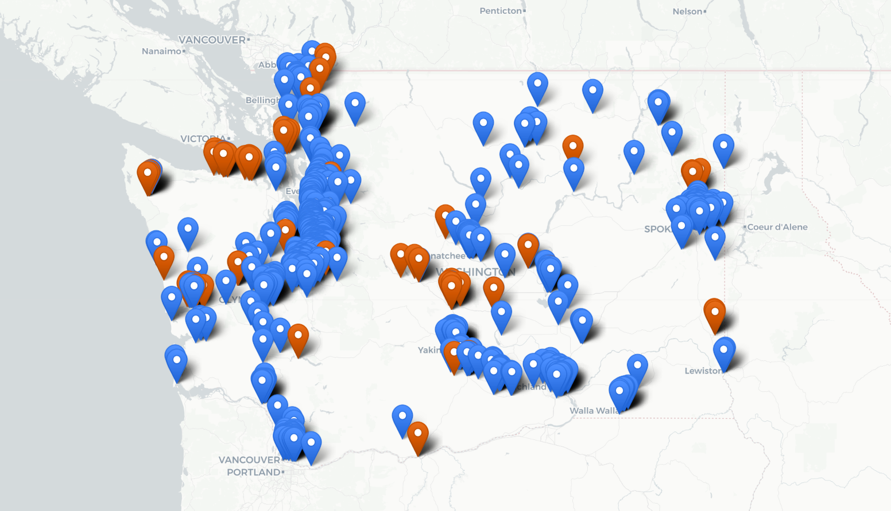
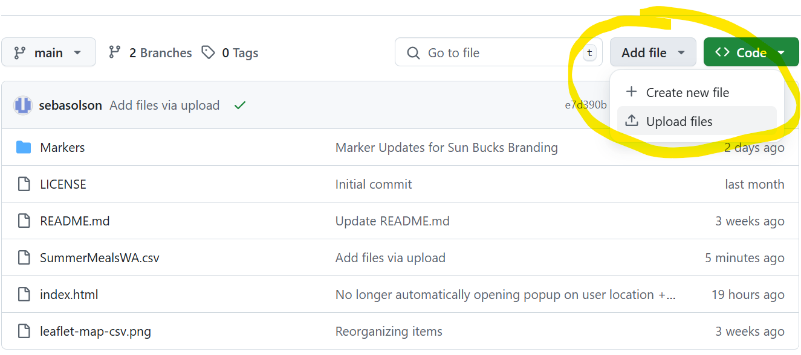
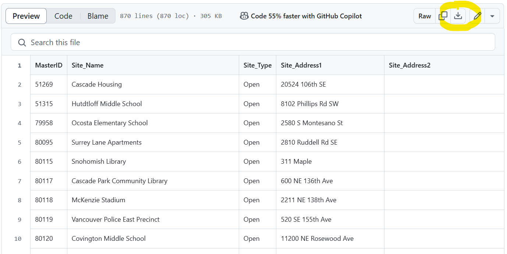

# Washington State Summer Meals Sites
Leaflet map displaying all Summer Meals sites for Hunger Free WA

## Instructions
### Updating Site Info
To update site info, find the "Add file" button in the repository and click "Upload file". 

Make sure the name of the file is "SummerMealsWA.csv". As long as the names are the same, the newly uploaded file will replace the existing one in the repository.
Also ensure that the CSV headers match the existing document. You can download the existing document by clicking on its name in the repository and clicking the download button circled in the screenshot below.

## Demo
https://sebasolson.github.io/SummerMealsWA/

Working map of WA with Summer Meals Sites.

## HandsOnDataViz Tutorial
To make your own, visit HandsOnDataViz
https://handsondataviz.org/leaflet-maps-with-csv.html

